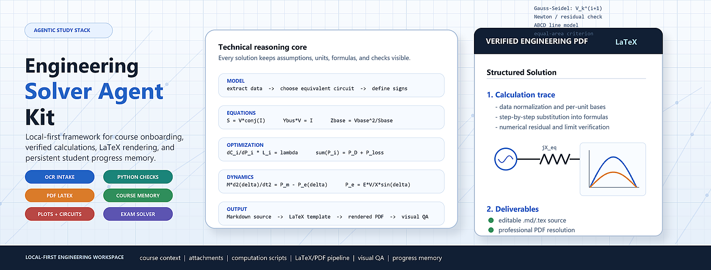

# Engineering Solver Agent Kit




**Engineering Solver Agent Kit** is a local agentic study framework for university engineering courses. It turns Codex or Claude Code into a structured technical tutor that can onboard a course, index teaching material, solve problems step by step, verify calculations, generate LaTeX-rendered PDFs, keep editable solution sources, and maintain a live record of the student's progress.

The core idea is simple:

```text
one course -> one local workspace -> one agent memory -> verified solved problems
```

This kit is designed for technical subjects where the student needs more than final answers: formulas, assumptions, unit conversions, sign conventions, numerical checks, diagrams, plots, and professionally formatted solution PDFs.

## What This Repository Contains

This is not a single prompt or a simple notes template. It is a complete local study system composed of several coordinated parts:

Current repository package:

- 88 source files selected for publication.
- 8 reusable agent skills.
- 10 local automation scripts.
- 16 technical documentation files, including operating modes.
- A complete vendored LaTeX/PDF production skill.
- Course workspace templates, live-memory templates, prompt templates, examples, and verification utilities.

1. **Agent instructions**
   - `AGENTS.md` for Codex-like agents.
   - `CLAUDE.md` for Claude Code.
   - Shared behavioral rules for technical tutoring, calculation-first solving, and local artifact management.

2. **Reusable agent skills**
   - `engineering-ocr-intake`: attachment intake, statement cleanup, OCR discipline, naming, and local archiving.
   - `engineering-calculation-verifier`: independent calculation checks, units, signs, constraints, residuals, and attempt auditing.
   - `formula-sheet-builder`: agent-facing equation and method maps for future problem solving.
   - `student-model-tracker`: student profile, learning preferences, progress evidence, recurring weaknesses, and personalized next actions.
   - `study-onboarding`: course setup, material inspection, and live context initialization.
   - `study-problem-solver`: engineering problem solving, verification, and attempt review.
   - `study-latex-pdf`: formal solution writing, LaTeX math rendering, PDF generation, and visual QA.
   - `paper-latex-layout`: full PDF production skill with Pandoc/LaTeX wrappers, Eisvogel template support, DOCX export, PDF page rendering, and layout QA utilities.

3. **Course workspace architecture**
   - A complete folder structure for one technical course.
   - Separate areas for course material, statements, editable solutions, PDFs, attachments, formula sheets, scripts, figures, mock exams, and assignments.

4. **Live memory files**
   - Student profile and learning preferences.
   - Course context.
   - Topic and equation summary.
   - Exam problem patterns.
   - Solution protocol.
   - Student progress and feedback log.

5. **Engineering solution protocols**
   - Mandatory first-run onboarding after installation.
   - Data extraction.
   - Unit and sign-convention checks.
   - Formula selection.
   - Step-by-step substitution.
   - Numerical verification.
   - Final answer formatting.
   - Error prevention checklist.

6. **LaTeX/PDF production workflow**
   - Markdown/LaTeX source files.
   - Rendered equations.
   - Tables for repeated calculations.
   - Figures and plots when useful.
   - PDF compilation workflow using local tools.
   - A complete vendored `paper-latex-layout` skill for high-quality academic PDF generation instead of a prompt-only PDF workflow.

7. **Local automation scripts**
   - Environment checker.
   - Course workspace creator.
   - Guided bootstrap script.
   - Image-to-PDF converter.
   - Material indexer.
   - Solution listing utility.
   - Statement/solution pairing checker.
   - PDF build helper.
   - Codex skill installer.
   - Full `paper-latex-layout` build/render/check scripts inside `skills/paper-latex-layout/scripts/`.

8. **Software/tooling assumptions**
   - Python runtime.
   - PowerShell or equivalent terminal.
   - LaTeX engine such as `pdflatex` or `xelatex`.
   - Optional Pandoc workflow.
   - Optional Python packages for images, PDF processing, plotting, and numerical checks.
   - Optional portable PDF toolchain compatible with the `paper-latex-layout` skill.

9. **Student interaction patterns**
   - Solved problem mode.
   - Attempt review mode.
   - Formula sheet mode.
   - Learning/explanation mode.
   - Mock exam mode.
   - Fast revision mode.

10. **Templates and examples**
    - Course onboarding templates.
    - Context templates.
    - Problem solution templates.
    - Attempt review templates.
    - Formula sheet entries.
    - A minimal demo engineering course.

## What It Does

- Builds a local course workspace from teaching material.
- Interviews the student during onboarding and stores a local profile for personalized tutoring.
- Maintains live context files for topics, equations, exam patterns, and student progress.
- Solves engineering problems with explicit assumptions, formulas, substitutions, and verification.
- Produces editable Markdown/LaTeX sources and final PDF solutions.
- Stores statements, attached images, scripts, figures, and solved outputs in predictable folders.
- Supports attempt review: the agent can compare the student's handwritten or typed solution against the correct procedure.
- Supports formula sheets, mock exams, assignment-style problems, and fast revision workflows.
- Provides reusable Codex skills for onboarding, problem solving, and LaTeX/PDF generation.

## Target Users

This repository is intended for engineering students who want to study a technical subject with an AI agent while keeping a rigorous local archive:

- solved exercises;
- exam problems;
- assignment problems;
- formula sheets;
- derivations;
- calculation scripts;
- figures and plots;
- progress tracking.

It is especially useful for subjects such as electrical power systems, circuits, control, signals, mechanics, thermodynamics, structures, numerical methods, and similar calculation-heavy courses.

## What This Is Not

- It is not a repository of notes for a specific university course.
- It does not include copyrighted teaching material.
- It does not replace the student's own reasoning or teacher feedback.
- It does not guarantee correctness without verification.
- It is not supposed to ship with a filled course archive. Course folders are templates that the agent populates during onboarding with the student's real material, statements, solved PDFs, scripts, and progress notes.

The agent must calculate first, verify second, and only then write the final explanation.

## Quick Start

1. Copy or clone this repository.
2. Open the repository with Codex or Claude Code.
3. Ask the agent:

```text
Read this repository, inspect README.md, AGENTS.md, and docs/INSTALLATION_AND_REQUIREMENTS.md.
Start the Engineering Solver Agent Kit onboarding for a new course.
```

4. The agent should ask you for the course name, university/degree, exam goal, current level, explanation style, and course material.
5. Upload or point to the material for one subject only.
6. Ask for solved problems, attempt reviews, formula sheets, or mock exams.

## First Agent Message

After installation, the agent must not leave the student with only a technical setup report. The first useful message should look like this, adapted to the student's language:

```text
Installed and ready.

This is not just a PDF template or a prompt pack. This kit turns Codex/Claude into a local engineering study agent for one university course: it can organize course material, build live context files, solve exercises step by step, verify calculations, generate LaTeX PDFs, review your attempts, create formula sheets, prepare mock exams, transcribe notes from photos, and track your progress.

Important rule: use one installation/workspace per course. Do not mix different subjects in the same workspace.

First, answer this short setup questionnaire:

1. Course name:
2. University and degree/program:
3. Target exam or assessment:
4. Current level: A very weak / B basic / C intermediate / D strong
5. Explanation style: A very step-by-step / B balanced / C concise exam style / D conceptual first

Then go to your university virtual classroom for that course, download a ZIP or folder with all available material, and give it to me: slides, notes, problem sheets, exams, official solutions, assignments, rubrics, handwritten photos, or screenshots.

After I analyze the material, I will create the course workspace, store and connect the files, build the live context files, and show you a project map with the main Markdown files, scripts, folders, and what each one contains for your specific course.

Then you can ask things like:

- "Solve this exam problem step by step and generate a LaTeX PDF."
- "Review my handwritten attempt and tell me where the first error appears."
- "Make a formula sheet for Topic 3 with units and when to use each equation."
- "Create a mock exam using this teacher's style."
- "Explain only this step; I do not understand where this formula comes from."
- "Transcribe these notes from photos and connect them with the theory."
```

The detailed protocol is in `docs/FIRST_RUN_ONBOARDING.md`, and a reusable prompt is available at `templates/prompts/first_run_onboarding_prompt.md`.

## Recommended Tooling

Minimum:

- Codex or Claude Code.
- Python 3.10 or newer.
- A terminal: PowerShell on Windows or an equivalent shell on Linux/macOS.
- Git.

Recommended for professional PDFs and visual verification:

- A LaTeX distribution: MiKTeX, TeX Live, or TinyTeX.
- `pdflatex` and/or `xelatex`.
- Pandoc.
- Python packages: Pillow, PyMuPDF, matplotlib, numpy, reportlab.

Install recommended Python packages:

```text
python -m pip install -r requirements.txt
```

Check the local environment:

```text
python scripts/check_environment.py
```

Guided preparation:

```text
python scripts/bootstrap.py --subject-path "Courses/Circuits_I" --subject-name "Circuits I"
```

Spanish first-run onboarding message:

```text
python scripts/bootstrap.py --onboarding-lang es
```

Create only the course workspace:

```text
python scripts/create_subject.py "Courses/Circuits_I" --name "Circuits I"
```

Install the included Codex skills:

```text
python scripts/install_codex_skills.py --codex-home PATH_TO_CODEX_HOME
```

Install skills and print the Spanish onboarding message:

```text
python scripts/install_codex_skills.py --codex-home PATH_TO_CODEX_HOME --onboarding-lang es
```

## Course Workspace Layout

Each subject must have its own workspace. Do not mix courses.

```text
00_Context/                 live course memory
  STUDENT_PROFILE.md        student profile and personalization rules
01_Course_Materials/        theory, slides, assignments, exams, solutions
02_Statements/              clean problem statements
03_Solution_Sources/        editable Markdown/LaTeX sources
04_Solution_PDFs/           final PDF solutions
05_Attachments/             original student images and captures
06_Formula_Sheets/          compact formula sheets and summaries
07_Progress_And_Feedback/   live student level, mistakes, corrections
08_Calculation_Scripts/     Python/MATLAB/etc. verification scripts
09_Figures/                 plots and diagrams used in PDFs
10_Mock_Exams/              generated practice exams
11_Assignments/             assignment-style exercises and deliverables
```

## Agent Workflow

For a formal problem solution, the agent should follow this sequence:

1. Read the statement and classify the topic.
2. Extract data, units, known variables, and unknowns.
3. State assumptions and sign conventions.
4. Choose the governing equations.
5. Compute the result independently before writing the solution.
6. Verify by dimensional checks, limiting cases, alternative formulas, or scripts.
7. Write the explanation in a university-level but readable style.
8. Generate figures when they clarify the method.
9. Produce a polished PDF with rendered LaTeX math.
10. Save statement, source, PDF, figures, scripts, and progress notes locally.

The priority is not just getting the numerical answer. The priority is making the method reproducible.

## Key Documents

```text
docs/HOW_TO_WORK_WITH_THE_AGENT.md
docs/COURSE_ONBOARDING_GUIDE.md
docs/INSTALLATION_AND_REQUIREMENTS.md
docs/COURSE_WORKSPACE_STRUCTURE.md
docs/LIVE_FILES_MAP.md
docs/LATEX_PDF_WORKFLOW.md
docs/ERROR_PREVENTION_PROTOCOL.md
docs/SOLUTION_PROTOCOL.md
docs/QA_CHECKLIST.md
```

## Included Skills

```text
skills/paper-latex-layout/
skills/engineering-ocr-intake/
skills/engineering-calculation-verifier/
skills/formula-sheet-builder/
skills/student-model-tracker/
skills/study-onboarding/
skills/study-problem-solver/
skills/study-latex-pdf/
```

These skills define the core behavior:

- course onboarding;
- OCR/attachment intake and statement preparation;
- rigorous engineering problem solving;
- independent calculation verification;
- agent-facing formula and method sheets;
- student profile and progress tracking;
- LaTeX/PDF production with calculation-first verification;
- professional PDF layout, compilation, DOCX export, page rendering, and visual QA through the complete `paper-latex-layout` skill.

## License

MIT. See `LICENSE`.
